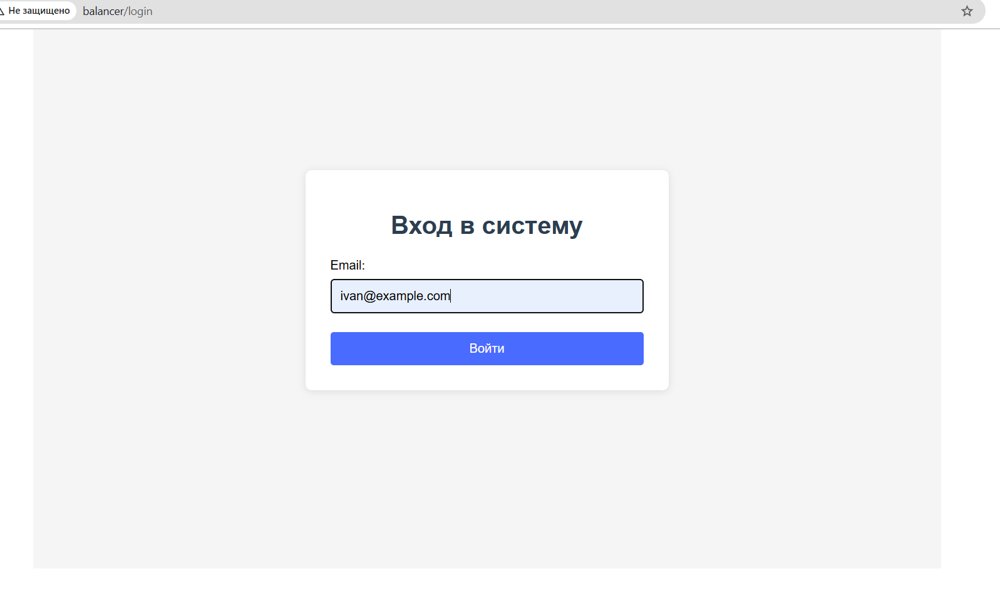
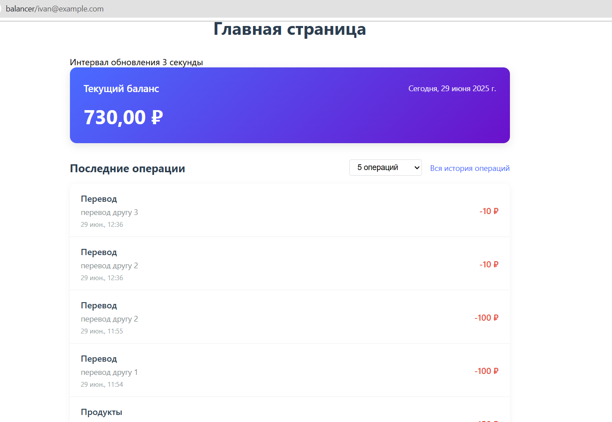
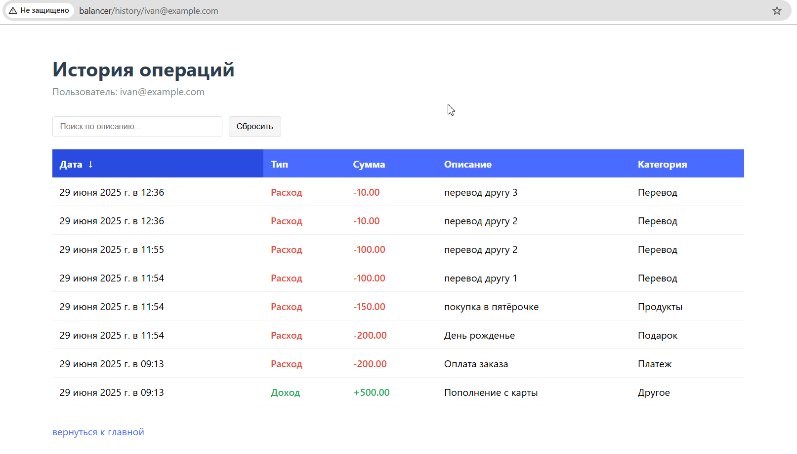

# Балансы пользователей

## Описание проекта
1) Создание пользователя и операций через консольные команды
2) Просмотр содержимого на страницах Логин/Главная/История операций

## Требования
- PHP 8.0+
- Laravel
- Composer
- Node.js 14+
- Vue
- npm
- База данных (MySQL)
- Git

## Установка проекта

### 1. Клонирование репозитория
```bash
git clone https://github.com/IgorTananakin/balancer
```

### 2. Настройка окружения
DB_CONNECTION=mysql
DB_HOST=127.0.0.1
DB_PORT=3306
DB_DATABASE=userbalancer
DB_USERNAME=root
DB_PASSWORD=

### 3. Установка зависимостей
```bash
composer install
npm install
```

### 4. Генерация ключа
```bash
php artisan key:generate
```

### 5. Запуск миграций
```bash
php artisan migrate
```

### 6. Сборка фронтенда
```bash
npm run build
```

## Работа с проектом
### Команды

1) Создание пользователя:
```bash
php artisan user:create "Имя Фамилия" email@example.com password --balance=1000
```

2) Проверка баланса:
```bash
php artisan balance:check email@example.com
```

3) Пополнение баланса:
```bash
php artisan balance:add email@example.com 500 --description="Пополнение"
```

4) Списание с баланса:
```bash
php artisan balance:subtract email@example.com 200 --description="Списание"
```

## Действие на страницах
1) Создать пользователя и занести ему средства с помощью команды
2) проверить по такому route и ввести email что он есть в базе  ( сам route /login )
3) проверить последнии 5 операций по такому route /ivan@example.com
4) история операций с сортировкой находится по такому route /history/ivan@example.com

## Страницы 
1) логин



2) главная



3) история операций


